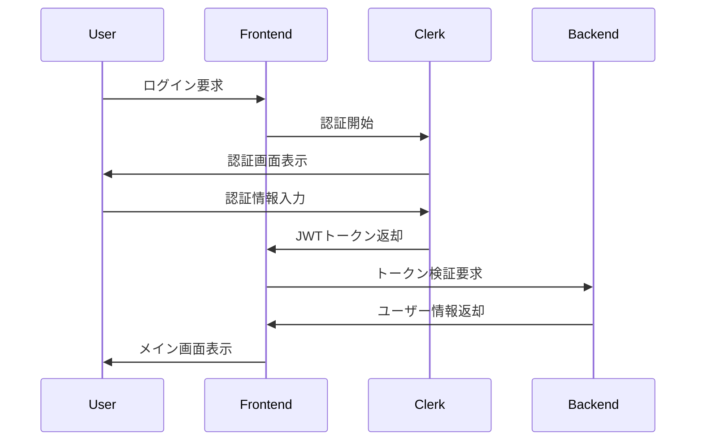
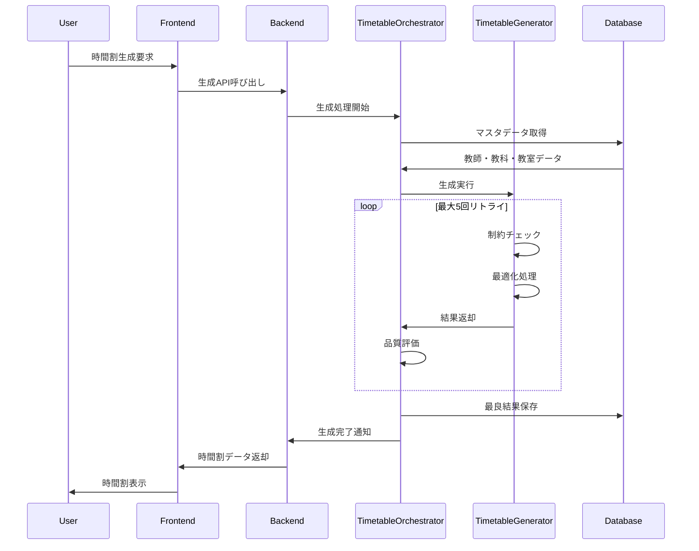
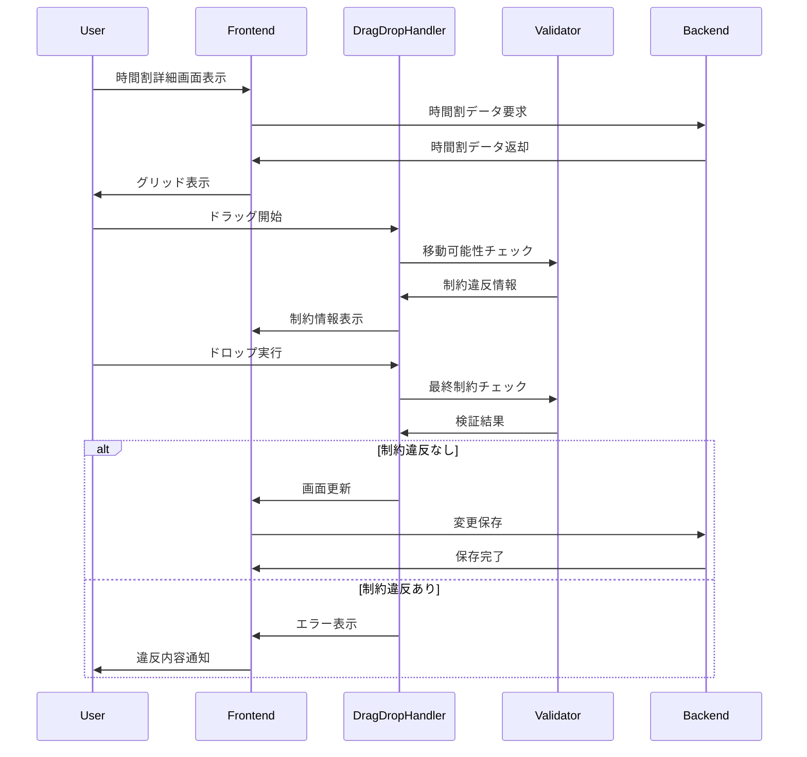
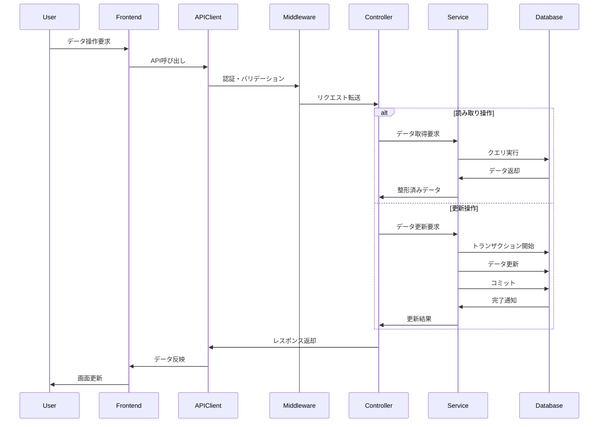

# 学校時間割管理システム - 基本設計書

## 1. システム概要

### 1.1 システム名称
学校時間割管理システム（School Timetable Management System）

### 1.2 システム目的
- 学校の時間割を自動生成・管理するWebアプリケーション
- 教師・教科・教室の制約を考慮した最適な時間割の作成
- 制約違反の可視化と手動編集による調整機能

### 1.3 利用者
- 学校管理者：全機能アクセス権限
- 教務担当者：時間割作成・編集権限
- 一般教師：参照権限

### 1.4 システム特徴
- **制約ベース生成**：教師・教室の競合、割当制限を自動チェック
- **最適化アルゴリズム**：複数試行による最適解探索（最大5回リトライ）
- **リアルタイム編集**：ドラッグ&ドロップによる時間割調整
- **制約違反表示**：3段階の重要度による色分け表示
- **レスポンシブデザイン**：モバイル・タブレット対応

## 2. システムアーキテクチャ概要

### 2.1 全体構成
```
[ Web Browser ]
       ↓ HTTPS
[ Cloudflare Workers ]
       ↓
[ React Frontend ] ← → [ Hono Backend ]
                           ↓
                  [ D1 Database (SQLite) ]
```

### 2.2 技術スタック

#### フロントエンド
- **フレームワーク**：React 19.1.0 + TypeScript 5.8.3
- **ルーティング**：React Router 7.6.3
- **スタイル**：Tailwind CSS 3.4.17
- **認証**：Clerk React 5.32.4
- **UI**：Radix UI + Lucide React
- **状態管理**：React Hooks
- **ドラッグ&ドロップ**：@dnd-kit

#### バックエンド
- **フレームワーク**：Hono 4.8.3
- **ランタイム**：Cloudflare Workers
- **データベース**：Cloudflare D1 (SQLite)
- **認証**：JWT + Clerk統合
- **バリデーション**：Zod 3.25.73
- **API文書**：OpenAPI + Swagger UI

#### インフラ
- **ホスティング**：Cloudflare Workers
- **データベース**：Cloudflare D1
- **認証プロバイダー**：Clerk
- **ドメイン管理**：Cloudflare
- **CI/CD**：GitHub Actions (想定)

### 2.3 ディレクトリ構成
```
src/
├── frontend/          # React フロントエンド
│   ├── components/    # UIコンポーネント
│   ├── hooks/         # カスタムフック
│   ├── lib/api/       # APIクライアント
│   ├── pages/         # ページコンポーネント
│   └── main.tsx       # エントリーポイント
├── backend/           # Hono バックエンド
│   ├── controllers/   # リクエスト処理
│   ├── middleware/    # 認証・バリデーション
│   ├── routes/        # ルート定義
│   ├── services/      # ビジネスロジック
│   └── index.tsx      # APIエントリーポイント
├── shared/            # 共有型定義
│   └── types.ts       # TypeScript型定義
└── worker.ts          # Workersエントリーポイント
```

## 3. 主要機能一覧

### 3.1 認証・認可機能
- **ログイン・ログアウト**：Clerk OAuth認証
- **権限管理**：Role Based Access Control (16種類の権限)
- **トークン管理**：JWT自動リフレッシュ機能
- **セッション管理**：1セッション1トークンアプローチ

### 3.2 マスタデータ管理
- **学校設定**：学年クラス数、授業時間数設定
- **教師管理**：担当教科・学年設定、割当制限設定
- **教科管理**：対象学年・週間時数・特別教室設定
- **教室管理**：タイプ・収容数・数量設定

### 3.3 時間割生成機能
- **自動生成**：制約ベースアルゴリズム
- **最適化モード**：複数試行による最良解探索
- **制約チェック**：教師競合・教室競合・時間制限
- **統計分析**：割当率・制約違反数・品質指標

### 3.4 時間割管理機能
- **一覧表示**：生成済み時間割リスト
- **詳細表示**：クラス別時間割グリッド
- **編集機能**：ドラッグ&ドロップによる調整
- **制約違反表示**：色分けによる視覚化

### 3.5 データ検証・分析機能
- **制約違反検証**：リアルタイム制約チェック
- **品質分析**：5項目の品質指標計算
- **改善提案**：システム自動推奨機能
- **統計レポート**：生成結果の詳細統計

## 4. 主要処理シーケンス図

### 4.1 ユーザー認証フロー


### 4.2 時間割生成フロー


### 4.3 時間割編集フロー


### 4.4 マスタデータCRUD フロー


## 5. セキュリティ設計概要

### 5.1 認証・認可
- **OAuth 2.0**：Clerk による統合認証
- **JWT**：ステートレスなトークンベース認証
- **RBAC**：Role Based Access Control実装

### 5.2 通信セキュリティ
- **HTTPS**：全通信の暗号化
- **CORS**：Cross-Origin Resource Sharing設定
- **CSRF保護**：ワンタイムトークンによる保護

### 5.3 API セキュリティ
- **Rate Limiting**：1分間100リクエスト制限
- **リクエスト検証**：Zod による入力値検証
- **セキュリティヘッダー**：XSS, Clickjacking 対策

## 6. パフォーマンス設計

### 6.1 フロントエンド最適化
- **コード分割**：React.lazy による遅延ローディング
- **メモ化**：React.memo, useMemo による再描画最適化
- **バンドル最適化**：Vite による高速ビルド

### 6.2 バックエンド最適化
- **接続プーリング**：D1 データベース接続管理
- **クエリ最適化**：インデックス活用・N+1問題回避
- **キャッシュ戦略**：セッション単位でのCSRFトークンキャッシュ

### 6.3 時間割生成最適化
- **バックトラッキング**：効率的な探索アルゴリズム
- **制約事前チェック**：無効な組み合わせの早期排除
- **並列処理**：複数候補の同時評価

## 7. 品質管理

### 7.1 テスト戦略
- **E2Eテスト**：Playwright による自動化テスト
- **単体テスト**：Vitest によるコンポーネントテスト
- **API テスト**：Hono テストクライアントによる統合テスト

### 7.2 品質指標
- **コード品質**：Biome による静的解析
- **型安全性**：TypeScript strict mode
- **パフォーマンス**：Core Web Vitals 準拠

### 7.3 監視・ログ
- **エラー追跡**：構造化エラーログ
- **パフォーマンス監視**：レスポンス時間計測
- **使用状況分析**：機能別使用状況追跡

---

**最終更新**: 2025年1月 | **バージョン**: 1.0.0